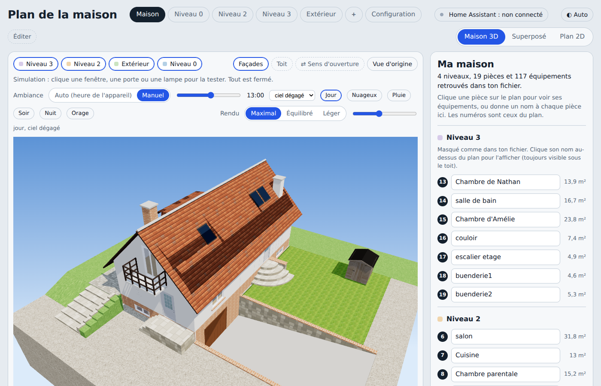
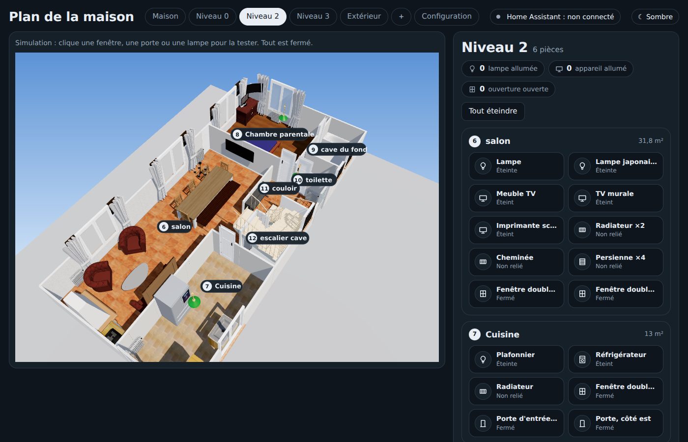
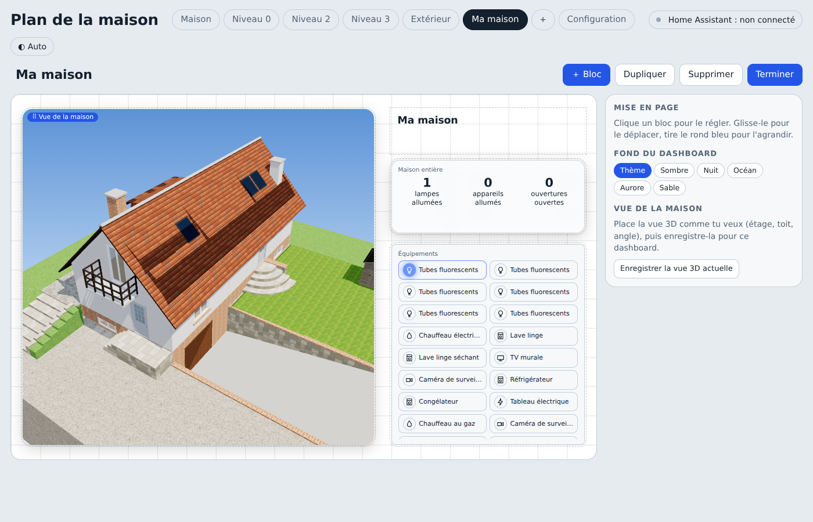
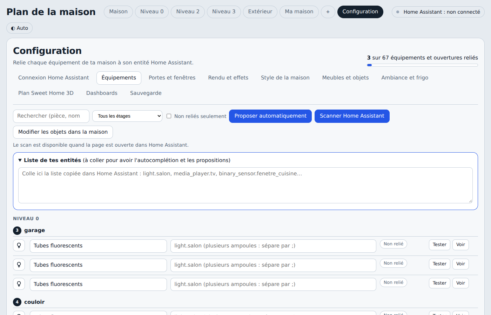
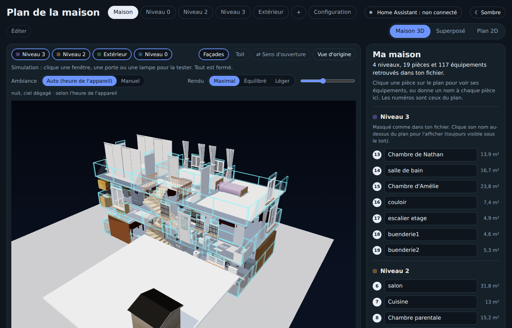
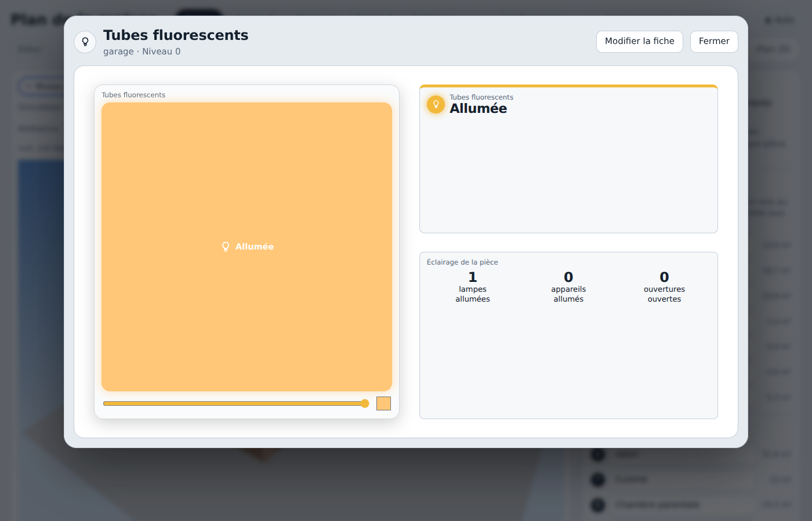
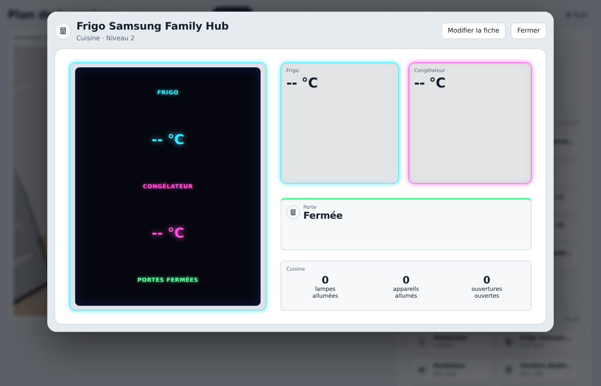
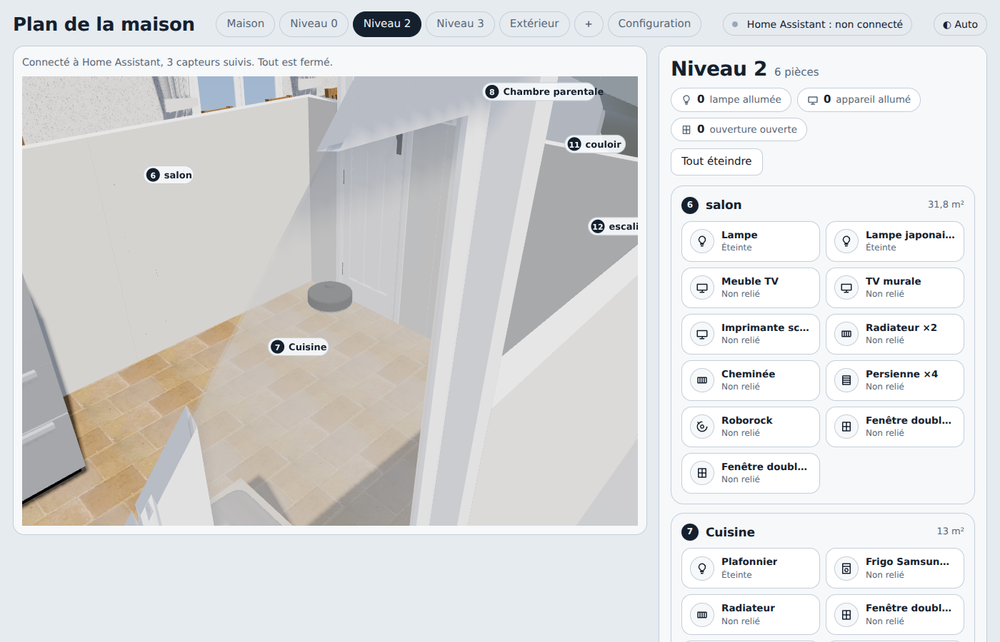

# Ma maison en 3D — tableau de bord Home Assistant

Un plan de maison en 3D, construit à partir d'un fichier **Sweet Home 3D**, à intégrer dans **Home Assistant**. Chaque pièce, chaque lampe, chaque porte et chaque fenêtre de la vraie maison devient un objet cliquable et pilotable dans la 3D.

Fait avec l'aide de [Claude](https://claude.ai) (Anthropic), en discutant et en ajustant au fil de l'eau — ce dépôt est le résultat de cet échange.



## Sommaire

- [Ce que ça fait](#ce-que-ça-fait)
- [Installation dans Home Assistant](#installation-dans-home-assistant)
- [Premiers pas](#premiers-pas)
- [Toutes les fonctionnalités](#toutes-les-fonctionnalités)
- [La carte personnalisée pour Home Assistant](#la-carte-personnalisée-pour-home-assistant)
- [Limites à connaître](#limites-à-connaître)
- [Remplacer par ta propre maison](#remplacer-par-ta-propre-maison)

## Ce que ça fait

La page affiche la maison en 3D, étage par étage, avec :

- un **plan fidèle** à un fichier Sweet Home 3D (murs, pièces, meubles, toit, escaliers) ;
- chaque **équipement relié à une entité Home Assistant** : lampes, prises, volets, caméras, chauffage, portes, fenêtres, aspirateur robot… ;
- des **dashboards personnalisés**, construits à la souris, avec des blocs de toutes sortes (état, interrupteur, jauge, caméra, carte, écran néon…) ;
- plusieurs **styles visuels**, du rendu réaliste à un mode « maison de poupée » holographique ;
- une **carte Home Assistant native** pour intégrer une vue de la maison dans n'importe quel tableau de bord, en quelques clics.

| | |
|---|---|
|  |  |
| Vue automatique d'un étage, avec la liste de ses équipements | Dashboard construit à la main, avec la 3D et des blocs |

## Installation dans Home Assistant

1. Télécharge le fichier `plan_maison_home_assistant.html` (l'export généré depuis ce projet) et dépose-le dans le dossier `/config/www/` de Home Assistant.
2. Il est alors accessible à l'adresse `/local/plan_maison_home_assistant.html`.
3. Ajoute-le à un tableau de bord, par exemple avec une carte **iframe** :

   ```yaml
   type: iframe
   url: /local/plan_maison_home_assistant.html
   aspect_ratio: 75%
   ```

   Ou installe la [carte personnalisée](#la-carte-personnalisée-pour-home-assistant) fournie dans ce dépôt, plus pratique pour choisir la vue à afficher.

4. Ouvre la page (directement, ou dans le tableau de bord) : elle se connecte automatiquement à Home Assistant si elle est chargée à l'intérieur de son interface.

**Ouvrir la page en dehors de Home Assistant** (pour un accès direct depuis un navigateur, sans passer par un tableau de bord) : Configuration → **Connexion Home Assistant**, renseigne l'adresse de ton serveur et un [jeton d'accès de longue durée](https://www.home-assistant.io/docs/authentication/#your-account-profile) créé depuis ton profil Home Assistant. Le jeton reste dans ce navigateur, il n'est jamais enregistré dans le fichier.

## Premiers pas

1. **Relie tes équipements** : Configuration → **Équipements** (et **Portes et fenêtres**). Pour chaque ligne, indique l'entité Home Assistant correspondante, ou utilise :
   - **Proposer automatiquement** : propose une entité par ressemblance de nom ;
   - **Scanner Home Assistant** : compare tes zones Home Assistant à tes pièces et propose les entités zone par zone (disponible une fois connecté).
2. **Nomme tes pièces** si ce n'est pas déjà fait, sur la page **Maison**.
3. **Choisis un style** dans Configuration → **Style de la maison** (voir plus bas).
4. **Construis un dashboard** si tu veux une vue sur mesure : bouton **＋** dans la barre du haut.



## Toutes les fonctionnalités

### Vue de la maison

- Vue 3D complète (« Maison »), un onglet par étage, et une vue « Extérieur ».
- Bascule **Façades** (murs ouverts/fermés) et **Toit** (avec/sans).
- **Sens d'ouverture** des portes et fenêtres, à inverser en un clic si elles s'ouvrent du mauvais côté.
- Portes de garage animées : elles se lèvent et basculent à plat sous le plafond, comme une vraie porte sectionnelle.
- Simulation d'ambiance : heure, météo, pluie, orage — en manuel ou calée sur l'entité `sun.sun` et la météo de Home Assistant.
- Rendu **Maximal / Équilibré / Léger** selon la puissance de l'appareil qui affiche la page.

### Style de la maison

Configuration → **Style de la maison** :

- 4 préréglages : **Réaliste**, **Holographique**, **Plan technique**, **Nuit néon** ;
- réglages fins indépendants : opacité des murs, intensité et couleur du contour lumineux, sol texturé ou schématique, fond (ciel réel ou une teinte unie) ;
- **vue « maison de poupée »** : un curseur abaisse les murs pour voir dans les pièces sans passer en vue de dessus ;
- **rotation automatique** de la maison, avec réglage de la vitesse ;
- possibilité de **masquer les numéros et noms de pièces** sur la vue 3D.



### Équipements et fiches

- Un clic sur un objet dans la 3D ouvre sa **fiche** : état, commandes, historique du bloc.
- Fiches personnalisables par glisser-déposer, avec toute une bibliothèque de blocs : état, interrupteur, lampe (couleur et intensité), valeur ou jauge, télé, volet, chauffage, caméra, résumé de pièce, liste d'équipements, écran néon, page ou carte Home Assistant intégrée, carte d'un robot aspirateur, texte libre…
- Chaque bloc peut être relié à **n'importe quelle entité** Home Assistant, pas seulement à l'équipement auquel il est rattaché — pratique pour regrouper plusieurs capteurs sur une seule fiche.
- Traits reliant un bloc à l'endroit exact de la maison qu'il concerne.



### Écran néon personnalisable

Un bloc à effet néon (fond noir, texte qui brille), sur le modèle de l'écran du frigo connecté : autant de lignes que tu veux, chacune avec son nom, son entité, son unité et sa couleur.



### Dashboards personnalisés

- Autant de dashboards que tu veux, chacun avec son propre agencement.
- La vue 3D de la maison comme bloc, à l'angle et l'étage de ton choix, avec sa propre rotation automatique.
- Vue « éclatée » : les étages écartés verticalement, cliquables, avec une transition animée vers l'étage choisi — pensée pour être intégrée sans aucun menu dans un tableau de bord Home Assistant.
- Fond au choix par dashboard (thème, sombre, nuit, océan, aurore, sable).

### Robots aspirateurs

- Repère 3D en forme de disque, avec la bosse du lidar, posé au sol — pas une simple icône plate.
- Un voyant s'allume autour de la base pendant le nettoyage.
- La carte de nettoyage (entité `image.` fournie par la plupart des intégrations robot) peut être superposée directement sur le vrai sol de la pièce, dans la vraie vue 3D : cale-la une fois (position, rotation, largeur, hauteur) et elle reste en place.



### Meubles et objets

- Import de meubles personnalisés (fichiers `.obj` + `.mtl`, `.zip`, ou bibliothèque `.sh3f`).
- Déplacement, rotation, duplication à la souris ou aux flèches, directement sur la vue 3D.
- Changement d'étage d'un objet ajouté, et réglage de ses dimensions (largeur, profondeur, hauteur) une fois posé.
- Mode édition accessible aussi bien depuis la page Maison que depuis Configuration.

### Plusieurs plans

- Garde plusieurs maisons ou plusieurs versions d'une même maison sur le même appareil, et bascule de l'une à l'autre.
- Import direct d'un fichier `.sh3d` mis à jour : les entités, noms et équipements déjà réglés sont conservés.

### Connexion à Home Assistant

- Automatique quand la page est intégrée dans un tableau de bord Home Assistant.
- Par jeton d'accès quand elle est ouverte directement dans un navigateur.
- Diagnostic intégré (Configuration → Ambiance et frigo) si le soleil ou l'heure semblent décalés.

### Sauvegarde

- Export et import de la configuration en JSON.
- Téléchargement de la page mise à jour avec un nouveau plan intégré.

## La carte personnalisée pour Home Assistant

Ce dépôt fournit `maison-card.js` : une vraie carte Lovelace, qui apparaît dans le menu **Ajouter une carte** de Home Assistant, avec un réglage visuel — pas besoin d'écrire de YAML.

**Installation :**

1. Dépose `maison-card.js` dans `/config/www/`.
2. Paramètres → Tableaux de bord → menu (⋮) en haut à droite → **Ressources** → **Ajouter une ressource**.
   - URL : `/local/maison-card.js`
   - Type : **Module JavaScript**
3. Recharge Home Assistant.

Ensuite, **Ajouter une carte** → cherche « **Ma maison** ». Un menu déroulant propose la vue complète, chaque étage, l'extérieur, et **tes dashboards personnalisés** — détectés automatiquement par leur vrai nom, tant que la carte et la page sont servies depuis la même adresse Home Assistant.

## Limites à connaître

- **Le toit, la lucarne, les cheminées, le terrain, le perron, la rampe de garage et le balcon** sont dessinés à la main pour la forme précise de cette maison. Si tu remplaces le plan par une maison de forme différente, ces éléments extérieurs ne s'adapteront pas automatiquement.
- **Le suivi en direct d'un robot aspirateur** n'est pas possible de façon fiable : Home Assistant ne fournit pas de position en continu sans risquer une limitation de l'API du fabricant. La superposition de la carte de nettoyage est la solution retenue à la place.
- La **détection automatique des dashboards personnalisés** dans la carte Lovelace suppose que la carte et la page sont sur le même nom de domaine.

## Remplacer par ta propre maison

Configuration → **Plan Sweet Home 3D** : dépose ton propre fichier `.sh3d`. Les pièces, murs, portes, fenêtres et meubles sont reconstruits à partir de ton fichier ; pense à relire la section [Limites à connaître](#limites-à-connaître) pour ce qui ne suivra pas automatiquement.

## Licence

À toi de choisir la licence qui te convient pour ce dépôt (par exemple MIT) en ajoutant un fichier `LICENSE`.
